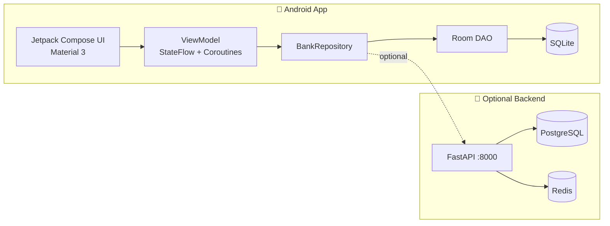

<div align="center">




<a href="https://github.com/mawiya-47/Bank-app">
  
</a>

<br/>


</div>

> [!WARNING]
> **Demo disclaimer:** AK Bank is a **fictional** banking app made only for demonstration and portfolio purposes. No real banking, payment gateways, or financial accounts exist. All balances, account numbers, IBANs and transactions are simulated.

---

## 🏛️ What is AK Bank?

A complete digital banking experience with a minimalist luxury look, built natively for Android. Think the polish of big mobile banking apps, but with original branding: **Navy `#0A2540`**, **Emerald Mint `#00D09C`** and **Gold `#E5A93C`**, with automatic dark and light mode.

<table>
<tr>
<td width="33%" valign="top">

### 👤 Customer
Accounts, transfers, bill payments, mobile top-up, virtual cards, AI financial assistant and statements.

</td>
<td width="33%" valign="top">

### 🛡️ Administrator
System liquidity overview, customer management, account suspend/activate, transaction reviews and an immutable audit trail.

</td>
<td width="33%" valign="top">

### 🎧 Support Agent
Customer inquiry lookup, support ticket threads and resolution status.

</td>
</tr>
</table>

---

## ⚡ Features

| | Feature | Details |
|---|---|---|
| 💸 | **Interbank Transfers** | Live balance validation and a digital receipt after every transfer |
| 💡 | **Bill Payments** | K-Electric, LESCO, SSGC, PTCL with biller lookup |
| 📶 | **Mobile Top-up** | Jazz, Telenor, Zong, Ufone |
| 💳 | **Virtual Debit Card** | Instant lock/freeze, spending-limit slider, CVV reveal |
| 🤖 | **AK Assistant** | Natural-language insights based on your real transaction history |
| 🗄️ | **Durable Storage** | Room/SQLite, pre-seeded with accounts, cards, billers and audit logs |
| 🔐 | **RBAC** | Three roles with separate screens and permissions |

---

## 🔑 Demo Credentials

Use the **1-tap demo login buttons** on the login screen, or enter these manually:

| Role | Email | Password | PIN |
|---|---|---|---|
| 👤 Customer | `demo@akbank.demo` | `Demo@12345` | `1234` |
| 🛡️ Admin | `admin@akbank.demo` | `Admin@12345` | `9999` |
| 🎧 Support | `support@akbank.demo` | `Support@12345` | `5555` |

---

## 🧱 Architecture



---

## 🛠️ Tech Stack

<div align="center">


</div>

- **Language:** Kotlin 2.2
- **UI:** Jetpack Compose (Material Design 3)
- **Persistence:** Room (SQLite) + KSP
- **State:** ViewModel, StateFlow, Coroutines
- **Navigation:** Navigation Compose
- **Backend (optional):** FastAPI + PostgreSQL + Redis via Docker Compose

---

## 🚀 Getting Started

### 📱 Run the Android app

```bash
git clone https://github.com/mawiya-47/Bank-app.git
cd Bank-app
```

1. Open the project in **Android Studio**.
2. Let Gradle sync finish.
3. Run on an emulator or a physical device.
4. Tap a demo login button and explore.

### 🐳 Run the optional backend

```bash
docker compose up --build
```

| Service | URL |
|---|---|
| API | http://localhost:8000 |
| Swagger Docs | http://localhost:8000/docs |

Copy `.env.example` to `.env` first if you need to change any settings.

---

## 📁 Project Structure

<details>
<summary><b>Click to expand</b></summary>

```
├── app/
│   └── src/main/java/com/example/
│       ├── MainActivity.kt
│       ├── data/
│       │   ├── local/        AppDatabase, BankDao, DatabaseInitializer
│       │   ├── model/        Entities
│       │   └── repository/   BankRepository
│       ├── ui/
│       │   ├── components/   CommonComponents
│       │   ├── screens/      admin, analytics, assistant, auth, cards,
│       │   │                 home, landing, profile, search, transfers
│       │   └── theme/        Color, Theme, Type
│       └── viewmodel/        BankViewModel
├── backend/                  Dockerfile, main.py, requirements.txt
├── database/                 init.sql
├── docker-compose.yml
└── metadata.json
```

</details>

---

## 🛡️ Privacy & Policy

- No dangerous runtime permissions required
- No real banking or financial data collected
- Demo CNIC and phone formats are fictional

---

<div align="center">

### Made with 💚 by [@mawiya-47](https://github.com/mawiya-47)

If you like this project, drop a ⭐


</div>
